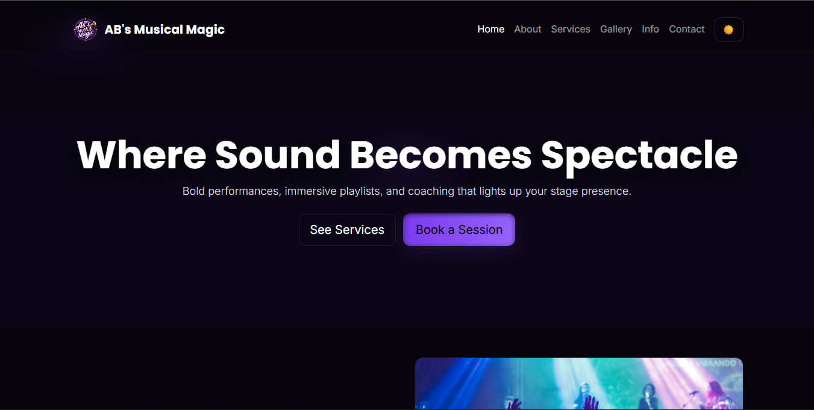
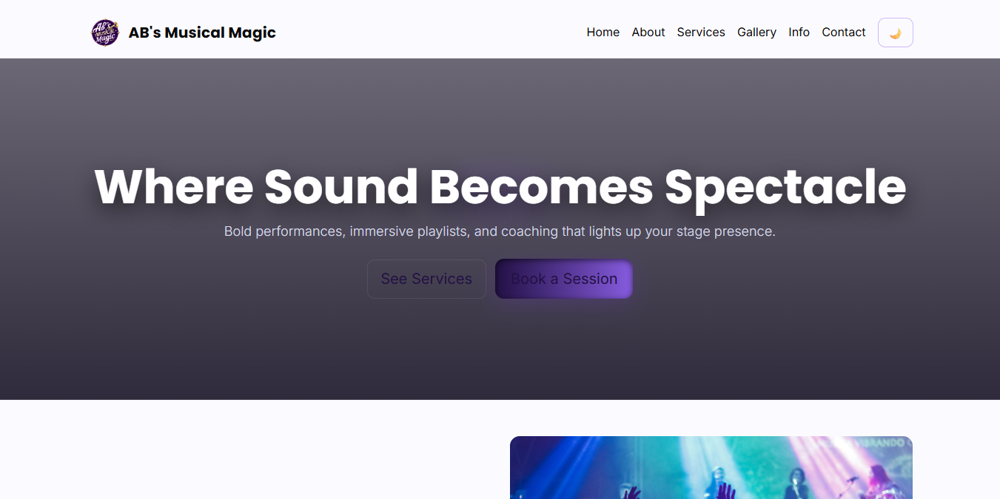
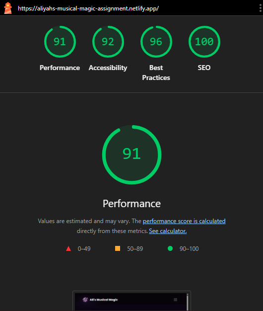

# Aliyah's Musical Magic

## Project Overview

**Aliyah's Musical Magic** is an interactive website designed to showcase my creative skills in web development using HTML, CSS, and JavaScript. The project emphasizes responsive design, user-friendly navigation, and dynamic interactivity, all deployed on **Netlify** for easy access.

---

## Features

* **Responsive Design**: Optimized for desktop, tablet, and mobile devices.
* **Light/Dark Mode Toggle**: Users can switch between themes.
* **Interactive Navigation**: Smooth scrolling and hover effects.
* **Dynamic Content**: JavaScript-driven elements enhance user engagement.
* **Performance Optimized**:
 Lighthouse scores: 91 (Performance), 92 (Accessibility), 96 (Best Practices), 100 (SEO).

---

## Getting Started

### Prerequisites

* Modern web browser (Chrome, Edge, Firefox)
* Internet connection for Netlify deployment

### Installation

1. Clone the repository:

   ```
   git clone  https://github.com/abethel-hash/aliyahs-musical-magic.git
   ```
2. Open `index.html` in your preferred browser.

### Deployment

* The website is hosted live on Netlify: [Aliyah's Musical Magic](https://aliyahs-musical-magic-assignment.netlify.app/)

---

## Code Examples

### HTML Snippet

```html
<div class="collapse navbar-collapse" id="navMenu">
        <ul class="navbar-nav ms-auto align-items-lg-center">
          <li class="nav-item"><a class="nav-link active" href="index.html">Home</a></li>
          <li class="nav-item"><a class="nav-link" href="about.html">About</a></li>
          <li class="nav-item"><a class="nav-link" href="services.html">Services</a></li>
          <li class="nav-item"><a class="nav-link" href="gallery.html">Gallery</a></li>
          <li class="nav-item"><a class="nav-link" href="info.html">Info</a></li>
          <li class="nav-item"><a class="nav-link" href="contact.html">Contact</a></li>
          <li class="nav-item ms-2">
            <button id="theme-toggle" class="btn btn-outline-neon" aria-pressed="false" aria-label="Toggle theme">🌙</button>
          </li>
        </ul>
      </div>
    </div>
  </nav>
```

### CSS Snippet

```css
:root{ 
  --bg:#06040a;
  --card:#0f0b16;
  --muted:#9aa0b2;
  --neon:#7c3aed;
  --neon-2:#ff4d8a;
  --glass: rgba(255,255,255,0.04);
  --accent: linear-gradient(90deg,var(--neon),#9b6bff 60%,var(--neon-2));
  --radius:14px;
  --fw-sans: "Inter", system-ui, -apple-system, "Segoe UI", Roboto, "Helvetica Neue", Arial;
  --fw-display: "Poppins", sans-serif;
}
```

### JavaScript Snippet

```javascript
function applyTheme(mode) {
    if (mode === 'light') {
      root.classList.add('light-mode');
      themeToggle.setAttribute('aria-pressed', 'false');
      themeToggle.textContent = '🌙';
    } else {
      root.classList.remove('light-mode');
      themeToggle.setAttribute('aria-pressed', 'true');
      themeToggle.textContent = '☀️';
    }
  }
```

---

## Screenshots




---

## Testing & Performance
 

* Lighthouse Performance Test:
The local version showed slower performance due to assets being loaded directly from the computer’s file system without optimization. The lack of caching, compression, and global distribution resulted in higher load times and reduced overall performance efficiency. However, after deploying the website to Netlify, performance significantly improved. Netlify automatically delivered all static assets (HTML, CSS, JS, images) through a global CDN, enabling faster load times, browser caching, minification, and efficient delivery across regions. The CDN also applied optimized cache-control headers, reducing load times by serving files from nearby edge locations


## License

This project is open source and free to use.


## Author

**Aliyah B.** – Web Developement Student-2023111009
